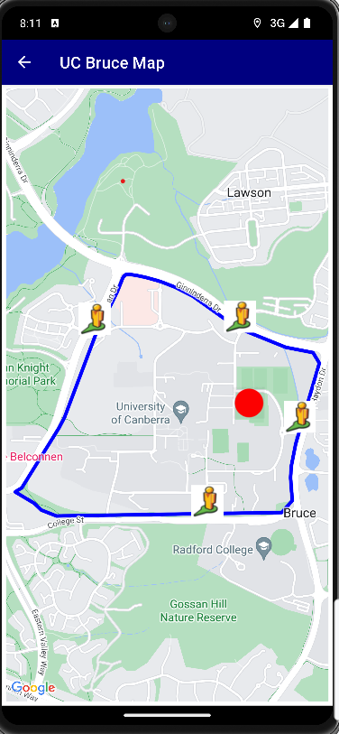
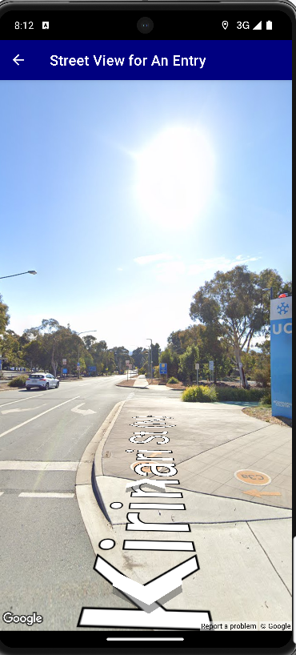

# Mobile Event Application

## Description
Final Assignment for Mobile Technology Unit at University of Canberra
-
Creating a mobile application integrating with Google services, Firebase database to store, display events' information and mapping locations.
---
#Languages, Framework
-
Java, FirebaseDatabase, GoogleAPIs.
---

## Feature
Outstanding Features
- Display Map, Current Location and 4 Location Sticks
---

---
- Filling, Storing and Loading Event Data using Firebase Database
---


1. Clone the repository:
   ```bash
   git clone https://github.com/david-pham-dev/Mobile-Event-App.git
